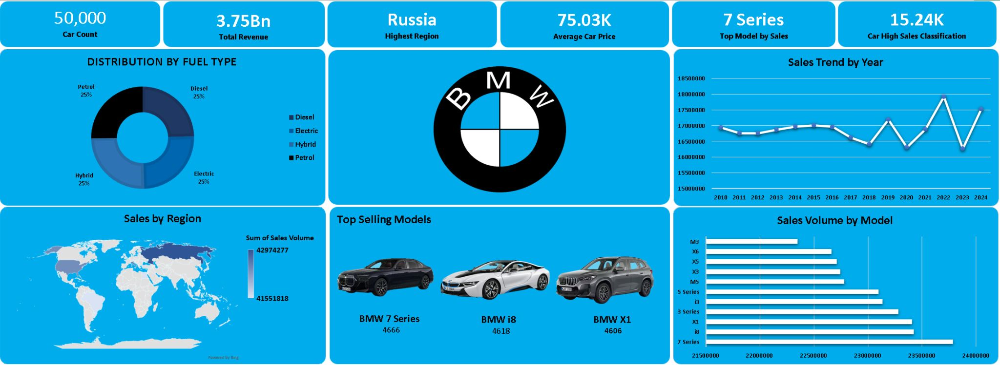

# BMW Sales Analytics Dashboard

## 📌 Project Overview
This project analyzes BMW sales performance using Excel, Power Query, Power BI, and DAX.  
It focuses on tracking revenue, profit, sales trends, and key business KPIs to support data-driven decision-making.

---

## 🎯 Objectives
- Analyze sales performance across time and categories
- Identify revenue and profit trends
- Build interactive dashboards for business insights
- Improve decision-making using data visualization

---

## 🛠️ Tools & Technologies
- Excel
- Power Query
- Power BI
- DAX

---

## 📊 Key KPIs
- Total Revenue
- Total Profit
- Total Units Sold
- Profit Margin
- Sales Trends over time

---

## 📷 Dashboard Preview

---

## 🔍 Key Insights
- Revenue trends show seasonal fluctuations
- Certain car models generate higher profit margins
- Sales performance varies significantly across categories

---

## 📁 Files in this Repository
- `BMW_Sales_Dashboard.pbix` → Power BI dashboard file
- `dataset.xlsx` → Raw dataset
- `dashboard_screenshot.png` → Main dashboard preview

---

## 🚀 How to Use
1. Download the `.pbix` file
2. Open it using Power BI Desktop
3. Explore filters and visuals interactively

---

## 📌 Author
Kareem Walid Hafez  
